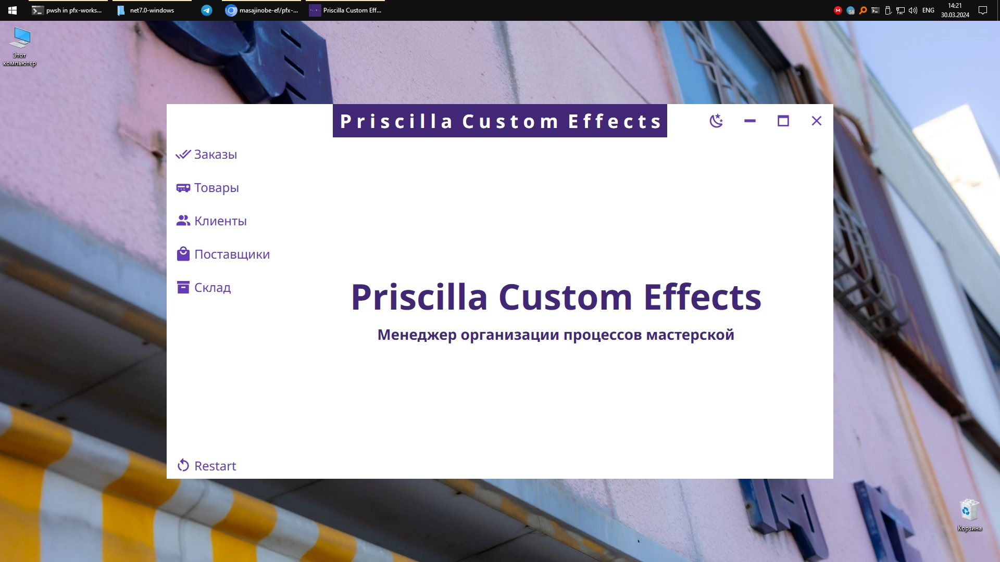

<p align="center">
    
</p>

<center>

# 🧢Priscilla Custom Effects management program with .NET-7.0 and PostgreSQL

</center>

<p align="center">
    <b><a href="https://github.com/masajinobe-ef/pfx-workshop-.net7.0/blob/main/README-EN.md">English</a></b>
    |
    <b><a href="https://github.com/masajinobe-ef/pfx-workshop-.net7.0">Russian</a></b>
</p>

[](https://github.com/masajinobe-ef/pfx-workshop-.net7.0/releases "Release version")
[](LICENSE "License")
[](https://boosty.to/priscilla-custom-effects "Donate")
[](https://boosty.to/priscilla-custom-effects "Stars")
[](https://github.com/masajinobe-ef/pfx-workshop-.net7.0 "Code Size")
[](https://github.com/masajinobe-ef/pfx-workshop-.net7.0 "Repository size")
[](https://github.com/masajinobe-ef/pfx-workshop-.net7.0 "Stars")

<p align="center" >
    <a href="https://priscilla-custom-effects.github.io">
        
    </a>
</p>

## 📄 Обзор

Мастерская Priscilla Custom Effects специализируется на создании индивидуальных эффектов для музыкальных инструментов. Наше программное обеспечение представляет собой инструмент для управления процессами и операциями, связанными с производством, заказами и инвентаризацией.

## 🛠️ Установка

Убедитесь, что у вас установлен [.NET 7.0 runtime](https://dotnet.microsoft.com/en-us/download/dotnet/7.0) и [PostgreSQL](https://www.postgresql.org).
Клонируйте репозиторий на локальную машину:

```sh
git clone https://github.com/masajinobe-ef/pfx-workshop-.net7.0.git
```

**[Доступные релизы](https://github.com/masajinobe-ef/pfx-workshop-.net7.0/releases)**

Настройте подключение к базе данных PostgreSQL в файле конфигурации **appsettings.json**:

```console
{
    "ConnectionString": {
        "Host": "127.0.0.1",    // Адрес хоста базы данных PostgreSQL
        "Port": "5432",         // Порт, на котором работает PostgreSQL
        "Database": "postgres", // Имя базы данных
        "Username": "postgres", // Имя пользователя для подключения к базе данных
        "Password": "0123",     // Пароль пользователя для подключения к базе данных
        "IncludeErrorDetail": "true" 
        // Флаг, указывающий, нужно ли включать подробные сведения об ошибках приложения
    }
}
```

## Лицензия

**This project is licensed under the GPL-3.0 license.**

Written by [@masajinobe](https://github.com/masajinobe-ef)